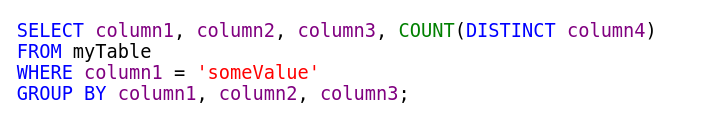

An more personal alternative to other, more extensive syntax highlighters, for SQL code blocks. Specify your schemas, tables, columns, and any packages or functions that you want colored. Specify the colors you prefer for everything. Simple code, simple customization. 


Example: 

## Before

```
SELECT column1, column2, column3, COUNT(DISTINCT column4)  
FROM myTable 
WHERE column1 = 'someValue' 
GROUP BY column1, column2, column3    
```

## After


